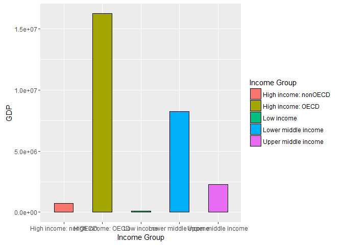

# caseStudy1
Vishi Cline  
October 26, 2016  


```r
knitr::opts_chunk$set(echo = TRUE)
library(knitr)
```

```
## Warning: package 'knitr' was built under R version 3.2.5
```

```r
opts_knit$set(root_dir = ".//Homework//R//caseStudy1//")
```

##Introduction
The goal of the following project is to conduct an analysis of the the Gross Domestic Product data of 190 ranked countries and compare it the the educational data, specifically the income groups, for the countries.

##Data Source
The data for the Gross Domestic Product and education is downloaded from the world bank website:  http://www.worldbank.org/.  The website contains comprehensive information regarding indicators about development in coountries around the globe.

##Code Files
The code is written in R and is modularized by data gathering, data tidying, and data analysis.  Below are the list of files and the purpose of each file, as well as a comprehensive explanation of key variables/data frames involved.

1.  init.R - installs a list of packages/libraries needed for   the project.
2.  Gather1.R - downlaods the data for gross domestic product   from the world bank website and loads it into a csv file named "gdp.csv".   
3.  Gather2.R - downlaods the educational data from the world   bank website and loads it into a csv file named "educ.csv".
4.  Tidy1.R - loads the gross domestic product data into the gppdata dataframe, preserves the raw version of data in another dataframe, and cleans the gross domestic product data by correcting the datatypes, assigning meaningful column names, removing null data and preparing it for analysis.
  * DataSets
    * gdp - Contains the original downloaded data from gdp.csv 
    * gdpraw  - Backup of the original raw data from gdp.csv
    * gdpdata - This is the data that will be cleaned and used for analysis.
    * incomes - Subset of gdpdata containing data related to country incomes.
    * world - Subset of gdpdata pertaining to the world data.
    * subtotals - Subset of gdpdata pertaining to the regions, as opposed to the countries.
  * Key Columns
    * CountryShortCode - Abbreviated used to describe the full country name.
    * ranking - ranking by the GDP (measured in Dollars)
    * Country - Country long name
    * GDP - Total Gross Domestic Product, measure in Dollars
    * Special Notes - information regarding inclusions/exclusions for the country data.
5.  Tidy2.R - loads the educational data into the gppdata dataframe, preserves the raw version of data in another dataframe, and cleans the educational data by correcting the datatypes, assigning meaningful column names, removing null data and preparing it for analysis.
  * DataSets
    * educ  - Contains the original downloaded data from educ.csv.  This is the data that is cleaned and used for analysis.
    * educraw - Backup of the original raw data from educ.csv
  *Key Columns
    * CountryShortCode - Abbreviated used to describe the full country name.  Original name was CountryCode, but this was changed for ease of analysis, as this is the key column.
    * IncomeGroup - Contains the overall income group category for a given country.  The values include:  High Income: nonOECD, High Income: OECD, Low Income, Lower middle income, Upper middle income.
6.  Analysis.R - Merges the gross domestic product data with the educational data, sorts the merged data, computes the average GDP rankings for High income: OECD and High income: nonOECD groups and plots the GDP for all countries against the Income Groups.  It also sections the GDP ranking into 5 separate quantile groups and presents a count of rankings by Income Groups. 
  * Datasets
    * matchingIDs - Contains the merged data based on the  country short name from the educ data frame (educ.csv) and the gdpdata data frame (gdp.csv)
    * ascendingOrder - Contains the sorted data from the matchingIDs data frame in ascending order by GDP.
    * rankingsForOECD - Contains the subset of data from matchingIDs data frame for the High Income:  OECD income groups only.
    * rankingsFornonOECD - Contains the subset of data from matchingIDs data frame for the High Income:  nonOECD income groups only.
    * df - new dataframe that contains the Income Group, ranking, GDP, and Quantile

##Code

Below is the code for downloading the data for the Gross Domestic Product to the gdp.csv file and the Education data to the educ.csv file.  This is following by data cleaning for both the files and then the analysis.  For detailed code within the corresponding makefiles, please refer to the appendix.


#Load the necessary packages

```r
# install.packages("downloader")
# install.packages("gdata")
# install.packages("ggplot2")
# install.packages("plyr")
source("init.R")
```

```
## Warning: package 'gdata' was built under R version 3.2.5
```

```
## Warning: package 'plyr' was built under R version 3.2.5
```

```
## Warning: package 'downloader' was built under R version 3.2.5
```

```
## Warning: package 'ggplot2' was built under R version 3.2.5
```

# Gather the data
The below makefile code will download the data from URL into a file.  The gross domestic product data will be downloaded to gdp.csv and the educational data will be downloaded to educ.csv.


```r
##Make File Code
source("Gather1.R")
source("Gather2.R")
```


#Tidy the data
Tidy1.R tidies the data for gross product domestic file.  It firsts reads the data from the csv file, gdp.csv, into the gdp data frame.  After that, in order to preserve the original data, this data is backed up into gdpraw data frame.  Gdp data frame will be scrubbed and prepared for analysis.  It names the columns to a meaningful values, deletes the empty columns, converts the data-types appropriately as needed, and removes the NA/blank values from the dataframe.  Since we are analyzing data for countries, there are certain columns that don't pertain to countries and are rather for the world or regions.  There are also some columns for income.  These columns are removed and placed in another dataframe for potential separate analysis.  Also, there is a special notes column which has abbreviations and the description for those abbreviations is explained at the bottom of the file.  The abbreviations in the Special Notes column in the dataframe was replaced by these descriptions, to make the data more readable for the user.

Tidy2.R tidies the data for educational file.  It reads the data from the csv file, edu.csv, into the educ data frame.  In order to preserve the original data, this data is backed up into educraw data frame.  Educ data frame is scrubbed and prepared for analysis.  NA/blank values are removed from IncomeGroup column.  Income.Group is renamed to IncomeGroup and CountryCode is renamed to CountryShortCode.  Both of these colums are used for analysis and since CountryShortCode is the key matching column in both files, CountryCode was renamed for ease of matching and keeping the columns names consistent.

```r
#R code to tidy the data for the gross domestic product 
source("Tidy1.R")
```

```
## Warning: NAs introduced by coercion
```

```r
#R code to tidy the data for educational data
source("Tidy2.R")
```


#Analysis
Analysis.R file is used to conduct analysis on the gross domestic product data in conjunction with the educational data.  The data from the gross domestic product is merged with the educational data by matching on CountryShortCode.  This data is then sorted by GDP in ascending order.  Please note that by doing so, we have effectively also sorted the GDP rankings in ascending order.  We then retrieve the average GDP rankings for the High income:OECD and High income:nonOECD income groups in order to observe the difference between the two in relation to each other.  Finally, the GDP for all the countries is plotted against the Income Group.  This is represented through the histogram below.  Furthermore, the GDP rankings are grouped into 5 separate quantiles, with Quantile1 representing the bottom 37 ranked GDPs and Quantile5 representing the top 38 ranked GDPs.  The reason for this uneven distribution is due to 189 observations.  The quantiles are presented in a tabular form against the Income Groups.

```r
source("Analysis.R")
```

<!-- -->

```
##         incomegroup
## quantile High income: nonOECD High income: OECD Low income
##        1                    1                 0         11
##        2                    5                 1         16
##        3                    8                 1          9
##        4                    5                10          1
##        5                    4                18          0
##         incomegroup
## quantile Lower middle income Upper middle income
##        1                  16                   9
##        2                   8                   8
##        3                  12                   8
##        4                  13                   9
##        5                   5                  11
```


 
# Conclusion
The precise ratios are as follows:
 High income:  nonOECD makes up 12% of the total GDP population.
 High income:  OECD makes up 16% of the total GDP population.
 Low income makes up 19% of the total GDP population.
 Low middle income makes up 28% of the total GDP population.
 Upper middle income makes up 24% of the total GDP population.
Based on the tabular data of the Income Groups vs. Quantile rankings, as well as the histogram, we can see that, eventhough, the low middle income seems to have the highest percentage of total GDP population, High income:  OECD income group makes up 47% of the top quantile group, consisting of 38 GDP values and it contains no low incomes.  This is represented by Quantile 5, which in this case consists of the top 38 GDPs.  The lowest quantile group, consisting of 37 GDP values, is composed of 43% of Lower middle incomes.   

  * Answers
    1. Merge the data based on the country shortcode. How many of the IDs match?
      By merging the gdp data with the educational data on country shortcode, the results show 189 country shortcodes that have maching IDs.
    
    2. Sort the data frame in ascending order by GDP (so United States is last). What is the 13th
    country in the resulting data frame?
      When the data is sorted in ascending order by GDP, the results show "St. Kitts and Nevis" is the 13th country.  Hence, it has the 13th lowest GDP.  This is represented in the code as sorting by the 34th column, which is the GDP.
    
    3. What are the average GDP rankings for the "High income: OECD" and "High income:
    nonOECD" groups?
      The average of High income: OECD is 32.97.  The average of High income: nonOECD is 91.91.  Hence, High income:nonOECD has a higher average GDP ranking than the High income: OECD.  
      
    4. Cut the GDP ranking into 5 separate quantile groups. Make a table versus Income.Group.
      How many countries are Lower middle income but among the 38 nations with highest
      GDP?
        After separating the quantile groups and making a table of the quantile groups vs. income groups, there are 5 countries that are lower middle income but among the 38 nations with highest gdp.  In our data, quantile 5 has the highest ranked gdp rankings, consisting of 38 observations and quantile 1 has the lowest ranked gdp rankings, consisting of 37 observations.
        

## Appendix
Code for Downloading the data:

```r
#######################################GATHER DATA#############################################
#Download and load the gross domestic product data by country into gdp.csv
download("https://d396qusza40orc.cloudfront.net/getdata%2Fdata%2FGDP.csv", destfile="gdp.csv")

#Download and load the educational data by country into educ.csv
download("https://d396qusza40orc.cloudfront.net/getdata%2Fdata%2FEDSTATS_Country.csv", destfile="educ.csv")
##############################################################################################
```

Code for tidying the data for gross domestic product:

```r
#######################################TIDY DATA FOR GDP#######################################
#read the gdp.csv file into gdp dataframe
gdp<-read.csv("gdp.csv", stringsAsFactors = FALSE, header=FALSE)

#Based on the data, it is evident that the data starts at row6 so exclude the first 6 rows
gdpdata<-gdp[6:236,]

#Rename the column variables
names(gdpdata)<-c("CountryShortCode","ranking","Del3","Country","GDP","SpecialNotes","Del7","Del8","Del9","Del10")

#Delete the empty columns
gdpdata$Del3<-NULL
gdpdata$Del7<-NULL
gdpdata$Del8<-NULL
gdpdata$Del9<-NULL
gdpdata$Del10<-NULL

#################################################################
#Data COnversions
################################################################
#Convert the data type for GDP to numeric and remove all formatting
gdpdata$GDP<-as.numeric(gsub(",","",gdpdata$GDP))
#Convert the data type for ranking to integer
gdpdata$ranking<-as.integer(gdpdata$ranking)
str(gdpdata)

#for any blank values, replace with NA
gdpdata[gdpdata==""] <- NA

#get a total count of all NA variables for GDP, CountryShortCode and ranking
count(is.na(gdpdata$GDP))
count(is.na(gdpdata$CountryShortCode))
count(is.na(gdpdata$ranking))

#############################################################################
#remove data that does not pertain to country and place in a separate dataset 
#############################################################################
#Following contains income data for the countries
incomes <- gdpdata[grep("income",gdpdata$Country,ignore.case=T),]

#Following contains world related data
world <- gdpdata[grep("world",gdpdata$Country,ignore.case=T),]

#Following rows pertain to regions as opposed to countries
subtotals<-gdpdata[grep("eap|eca|lac|mna|sas|ssa|emu",gdpdata$CountryShortCode,ignore.case=T),]

#Remove the data pertaining to incomes, the world and the subtotals for regions from country dataset
gdpdata<-subset(gdpdata, !(gdpdata$Country %in% incomes$Country))
gdpdata<-subset(gdpdata, !(gdpdata$Country %in% world$Country))
gdpdata<-subset(gdpdata, !(gdpdata$Country %in% subtotals$Country))

#remove all the NA's for CountryShortCode, GDP, and ranking from gdpdata
gdpdata <- gdpdata[!is.na(gdpdata$CountryShortCode),]
gdpdata <- gdpdata[!is.na(gdpdata$GDP),]
gdpdata <- gdpdata[!is.na(gdpdata$ranking),]

#Upate the special notes to contain more meaningful information, rather than abbreviations
gdpdata$SpecialNotes<-sapply(gdpdata$SpecialNotes,switch,
                a = "Includes Former Spanish Sahara",
                b = "Excludes south Sudan", 
                c = "Covers mainland Tanzania only", 
                d = "Data are for the area controlled by the government of Repulic of Cyprus",
                e = "Excludes Abkhazia and South Ossetia",
                f = "Excludes Transnistria")
##############################################################################################
```

Code for tidying the data for educational data:

```r
#######################################TIDY DATA FOR EDUC#######################################
#read the educ.csv file into educ dataframe
educ<-read.csv("educ.csv", stringsAsFactors = FALSE, header=TRUE)

#analyze the columns and data types for the columns
str(educ)

#store the raw data into educraw
educraw<-educ

#retrieve data for analyzing the raw data for the file
#get the first 5 rows, and the last 100 rows
head(educ,5)
tail(educ,100)

#for any blank values, replace with NA
educ[educ==""] <- NA

#rename the CountryCode column to CountryShortCode and Income.Group to IncomeGroup
colnames(educ)[colnames(educ)=="CountryCode"]<- "CountryShortCode"
colnames(educ)[colnames(educ)=="Income.Group"]<- "IncomeGroup"

#get a total count of all NA variables for CountryCode and Income.Group
count(is.na(educ$CountryShortCode))
count(is.na(educ$IncomeGroup))

#remove all the NA's from IncomeGroup
educ<- educ[!is.na(educ$IncomeGroup),]
##############################################################################################
```

Code for performing the analyis on the data:

```r
#######################################ANALYSIS#######################################
#Merge the data based on the country shortcode.
matchingIDs<-merge(educ,gdpdata,by="CountryShortCode", all=FALSE) 
#number of machingIDs
nrow(matchingIDs)

#Sort the data frame in ascending order by GDP (so United States is last).
ascendingOrder<-matchingIDs[order(matchingIDs[,34]),]
#The 13th country in the resulting data frame
ascendingOrder[13,2]

#the average GDP rankings for the "High income: OECD" and "High income:nonOECD" groups
rankingsForOECD <- matchingIDs[which(matchingIDs$IncomeGroup=="High income: OECD"),]
mean(rankingsForOECD$ranking)
rankingsFornonOECD <- matchingIDs[which(matchingIDs$IncomeGroup=="High income: nonOECD"),]
mean(rankingsFornonOECD$ranking)

#Plot the GDP for all of the countries. Use ggplot2 to color your plot by Income Group.
g<-ggplot(ascendingOrder,aes(x=factor(ascendingOrder$IncomeGroup), y=ascendingOrder$GDP, fill=factor(ascendingOrder$IncomeGroup)))+ geom_bar(width=.5,stat="identity",
colour="black",position=position_dodge())+xlab("Income Group")+ylab("GDP")+labs(fill="Income Group")
print(g)

#######################################################################################
#Cut the GDP ranking into 5 separate quantile groups. Make a table versus Income.Group.
######################################################################################
#Get the number of rankings
CountOfRows<-length(ascendingOrder$ranking)
#Create a new dataframe called df, with quantile and ranking column
df<-data.frame(incomeGroup=character(0),quantile=numeric(0),ranking=numeric(0), GDP=numeric(0), stringsAsFactors = FALSE)
#Calculate the number of obervations per group, for the 5 quantile groups
ObservationsinGroups<-round(CountOfRows/5, digits=0)
#initialize grp variable
grp<-1
#populate the df data frame with the observed ranking, GDP, Income Group and the corresponding quantile group
for (i in 1:CountOfRows)
{
  
  if (i %% ObservationsinGroups==0)
  {grp<-grp+1}
  
  df[i,"quantile"]<-grp
  df[i,"ranking"]<-ascendingOrder$ranking[i]
  df[i,"GDP"]<-ascendingOrder$GDP[i]
  df[i,"incomeGroup"]<-ascendingOrder$IncomeGroup[i]
 
}

#Make a table of GDP versus Income.Group.
print(table(quantile=df$quantile, incomegroup=factor(df$incomeGroup)))
##############################################################################################
```
